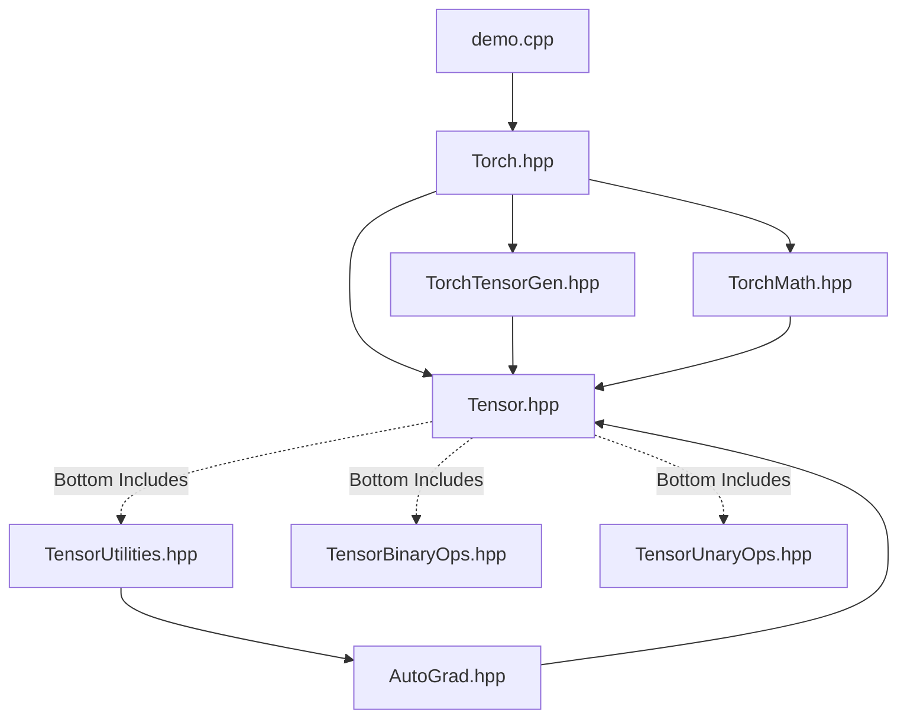

# C++ Template Library Dependency Architecture (C++ 模板库依赖架构)

In a header-only C++ template library (like yours, Eigen, or parts of PyTorch's ATen), managing `#include` relationships is one of the most challenging tasks. Because template definitions must be visible to the compiler at instantiation time, we cannot easily separate `.h` and `.cpp` files.

## 1. Current Dependency Map (当前依赖拓扑)

Here is the current state of your project's include graph:



### 1.1 The "Bottom Include" Pattern (底部包含模式)
In `Tensor.hpp`, you declared the `Tensor` class, and at the very bottom, you included the `.hpp` files containing the implementations (`TensorUtilities.hpp`, etc.). 
- **Pros:** It works well for small template classes. Users only need to `#include "Tensor.hpp"`, and they get both declarations and definitions.
- **Cons:** It makes the dependency chain highly sensitive to the order of inclusion. If `TensorUtilities.hpp` needs something from `AutoGrad.hpp`, and `AutoGrad.hpp` needs `Tensor.hpp`, it easily creates a **Circular Dependency (循环依赖)**.

---

## 2. The Autograd Circular Dependency Problem (Autograd 的循环依赖陷阱)

To implement Autograd, we face a classic C++ paradox:
1. `Tensor` needs a pointer to `AutogradMeta` (`shared_ptr<AutogradMeta>`).
2. `AutogradMeta` needs a concrete `Tensor` to store the gradient (`Tensor<real> grad;`).
3. `BackwardFunction` needs a concrete `Tensor` for its `apply` method.

If they all `#include` each other, the compiler will fail with "incomplete type" errors.

---

## 3. Architectural Improvement Suggestions (架构优化建议)

To keep the project scalable and professional, adopt the following strict rules:

### Rule 1: Master the "Forward Declaration" (前向声明)
Whenever a class only needs a **Pointer** or **Reference** (including `shared_ptr` or `weak_ptr`) to another class, **NEVER `#include` the header**. Use a forward declaration instead.

**In `Tensor.hpp`:**
```cpp
// Correct: Just tell the compiler these exist. Do NOT include AutoGrad.hpp here.
template<typename real> struct AutogradMeta;
template<typename real> class BackwardFunction;

template<typename real>
class Tensor {
    // Valid! The compiler only needs to know the size of a pointer.
    std::shared_ptr<AutogradMeta<real>> autograd_meta_; 
};
```

### Rule 2: `#include` in the Implementation Files, not Headers
You only need the full definition of a class when you instantiate it (e.g., calling `new`, `make_shared`, or accessing its methods/members). 

**In `TensorUtilities.hpp` (where you implement the constructor):**
```cpp
// Correct: Now we actually need to create AutogradMeta, so we include it.
#include "../Torch/AutoGrad/AutoGrad.hpp"

template<typename real>
Tensor<real>::Tensor(...) {
    autograd_meta_ = std::make_shared<AutogradMeta<real>>();
}
```

**In `AutoGrad.hpp`:**
```cpp
// Correct: AutogradMeta stores a Tensor BY VALUE, so it MUST see the full Tensor class.
#include "../../Tensor.hpp"

template<typename real>
struct AutogradMeta {
    Tensor<real> grad; // Requires the full definition of Tensor
};
```

### Rule 3: The `-inl.hpp` Pattern (Optional but Recommended for Large Projects)
If `Tensor.hpp` gets too large, separate it into:
1. `Tensor.h` (Only class declarations and forward declarations).
2. `Tensor-inl.h` (Only template implementations).
Users include `Tensor.h`, and `Tensor.h` includes `Tensor-inl.h` at the bottom. This is exactly what Eigen and PyTorch do. For now, your "Bottom Include" pattern is a simplified version of this and is acceptable as long as you strictly follow Rules 1 and 2.

---

## 4. The Path Forward (下一步行动路线)

1. **Clean up `Tensor.hpp`**: Add forward declarations for `AutogradMeta` and `BackwardFunction`. Replace `requires_grad_` with `shared_ptr<AutogradMeta<real>> autograd_meta_`.
2. **Create `AutoGrad.hpp`**: Define `BackwardFunction` and `AutogradMeta` as shown in the abstract.
3. **Update `TensorUtilities.hpp`**: Include `AutoGrad.hpp` and initialize `autograd_meta_` in all constructors. Add getters/setters for gradients.
4. **Test Compilation**: Ensure there are no circular dependency compiler errors.